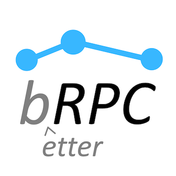

[English version](../en/README.md)

# brpc详解

## 项目简介
百度内最常使用的工业级RPC框架, 有1,000,000+个实例(不包含client)和上千种多种服务。"brpc"的含义是"better RPC"。

你可以使用它：

* 搭建能在**一个端口**支持多协议的服务, 或访问各种服务
* restful http/https, [h2](https://http2.github.io/http2-spec)/[gRPC](https://grpc.io)。使用brpc的http实现比[libcurl](https://curl.haxx.se/libcurl/)方便多了。从其他语言通过HTTP/h2+json访问基于protobuf的协议.
* [redis](redis_client.md)和[memcached](memcache_client.md), 线程安全，比官方client更方便。
* [rtmp](https://github.com/brpc/brpc/blob/master/src/brpc/rtmp.h)/[flv](https://en.wikipedia.org/wiki/Flash_Video)/[hls](https://en.wikipedia.org/wiki/HTTP_Live_Streaming), 可用于搭建[流媒体服务](https://github.com/brpc/media-server).
* hadoop_rpc(可能开源)
* 支持[rdma](https://en.wikipedia.org/wiki/Remote_direct_memory_access)(即将开源)
* 支持[thrift](thrift.md) , 线程安全，比官方client更方便
* 各种百度内使用的协议: [baidu_std](baidu_std.md), [streaming_rpc](streaming_rpc.md), hulu_pbrpc, [sofa_pbrpc](https://github.com/baidu/sofa-pbrpc), nova_pbrpc, public_pbrpc, ubrpc和使用nshead的各种协议.
* 基于工业级的[RAFT算法](https://raft.github.io)实现搭建[高可用](https://en.wikipedia.org/wiki/High_availability)分布式系统，已在[braft](https://github.com/brpc/braft)开源。
* Server能[同步](server.md)或[异步](server.md#异步service)处理请求。
* Client支持[同步](client.md#同步访问)、[异步](client.md#异步访问)、[半同步](client.md#半同步)，或使用[组合channels](combo_channel.md)简化复杂的分库或并发访问。
* [通过http界面](builtin_service.md)调试服务, 使用[cpu](cpu_profiler.md), [heap](heap_profiler.md), [contention](contention_profiler.md) profilers.
* 获得[更好的延时和吞吐](overview.md#更好的延时和吞吐).
* 把你组织中使用的协议快速地[加入brpc](new_protocol.md)，或定制各类组件, 包括[命名服务](load_balancing.md#命名服务) (dns, zk, etcd), [负载均衡](load_balancing.md#负载均衡) (rr, random, consistent hashing)

## 概述与构建

* 通过[概述](overview.md)了解哪里可以用brpc及其优势。
* 阅读[编译步骤](getting_started.md)了解如何开始使用, 之后可以运行一下[示例程序](https://github.com/brpc/brpc/tree/master/example/).

## 文档描述:
* [性能测试](benchmark.md)
* [bvar](bvar.md)
  * [bvar_c++](bvar_c++.md)
* [bthread](bthread.md)
  * [bthread or not](bthread_or_not.md)
  * [thread-local](thread_local.md)
  * [Execution Queue](execution_queue.md)
## Client
* [基础功能](client.md)
* [错误码](error_code.md)
* [组合channels](combo_channel.md)
* [访问http/h2](http_client.md)
* [访问gRPC](http_derivatives.md#h2grpc)
* [访问thrift](thrift.md#client端访问thrift-server)
* [访问UB](ub_client.md)
* [Streaming RPC](streaming_rpc.md)
* [访问redis](redis_client.md)
* [访问memcached](memcache_client.md)
* [Backup request](backup_request.md)
* [Dummy server](dummy_server.md)
## Server
* [基础功能](server.md)
* [搭建http/h2服务](http_service.md)
* [搭建gRPC服务](http_derivatives.md#h2grpc)
* [搭建thrift服务](thrift.md#server端处理thrift请求)
* [搭建Nshead服务](nshead_service.md)
* [高效率排查server卡顿](server_debugging.md)
* [推送](server_push.md)
* [雪崩](avalanche.md)
* [自适应限流](auto_concurrency_limiter.md)
* [流媒体服务](https://github.com/brpc/media-server)
* [json2pb](json2pb.md)
## [内置服务](builtin_service.md)
* [status](status.md)
* [vars](vars.md)
* [connections](connections.md)
* [flags](flags.md)
* [rpcz](rpcz.md)
* [cpu_profiler](cpu_profiler.md)
* [heap_profiler](heap_profiler.md)
* [contention_profiler](contention_profiler.md)
## 工具
* [rpc_press](rpc_press.md)
* [rpc_replay](rpc_replay.md)
* [rpc_view](rpc_view.md)
* [benchmark_http](benchmark_http.md)
* [parallel_http](parallel_http.md)
## 其他
* [IOBuf](iobuf.md)
* [Streaming Log](streaming_log.md)
* [FlatMap](flatmap.md)
* [brpc外功修炼宝典](brpc_intro.pptx)(培训材料)
* [搭建大型服务入门](../en/tutorial_on_building_services.pptx)(培训材料)
* [brpc内功修炼宝典](../en/brpc_internal.pptx)(培训材料)
## 深入RPC
* [New Protocol](new_protocol.md)
* [Atomic instructions](atomic_instructions.md)
* [IO](io.md)
* [Threading Overview](threading_overview.md)
* [Load Balancing](load_balancing.md)
* [Locality-aware](lalb.md)
* [Consistent Hashing](consistent_hashing.md)
* [Memory Management](memory_management.md)
* [Timer keeping](timer_keeping.md)
* [bthread_id](bthread_id.md)
## Use cases inside Baidu
* [百度地图api入口](case_apicontrol.md)
* [联盟DSP](case_baidu_dsp.md)
* [ELF学习框架](case_elf.md)
* [云平台代理服务](case_ubrpc.md)

## 贡献代码

请参考[这里](CONTRIBUTING.md#chinese-version)。

## 反馈和参与

* bug、疑惑、修改建议都欢迎提在[Github Issues](https://github.com/apache/incubator-brpc/issues)中
* 订阅邮件列表(dev-subscribe@brpc.apache.org)获得项目最新信息
